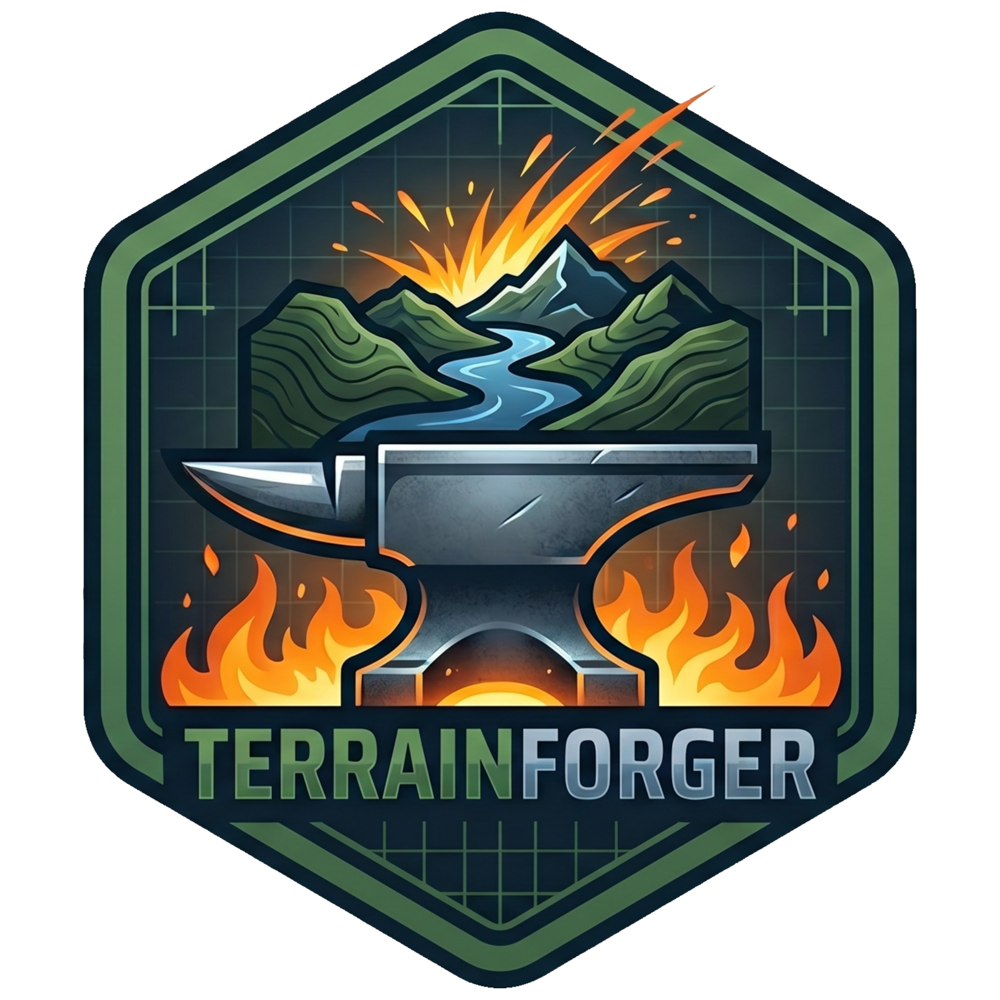

# TerrainForger

<p align="center">
  
</p>

Unity Editor package para baixar dados GIS, exportar GeoTIFF para RAW/PNG e importar tiles de terreno.

## Dependencias

### Unity / UPM

- `com.unity.modules.terrain`: necessario para criar e manipular `Terrain`, `TerrainData` e `TerrainLayer`
- `com.unity.modules.imageconversion`: necessario para carregar previews raster com `Texture2D.LoadImage`

### Requisitos externos

- Unity `2020.3` ou superior
- QGIS instalado localmente para os fluxos de GeoTIFF e preview raster que usam ferramentas GDAL
- Chaves/configuracoes dos provedores quando voce usar downloads online:
  - OpenTopography
  - Mapbox
  - Google Maps Platform
  - Copernicus Data Space

## Instalacao

### Via Git URL

No `Packages/manifest.json` do projeto Unity:

```json
{
  "dependencies": {
    "com.arantes83.terrainforger": "https://github.com/Arantes83/terrainforger.git"
  }
}
```

### Via Package Manager

Abra `Window > Package Manager`, escolha `Add package from git URL...` e informe a URL do repositorio.

### Via pasta local

Se estiver desenvolvendo localmente, use `Add package from disk...` e selecione o `package.json` deste repositorio.

## Estrutura do package

- `package.json`: metadados do UPM package
- `Editor`: scripts editor-only do addon
- `Documentation~`: documentacao do package

## Menus criados no Unity

- `Tools/TerrainForger/Get GIS Data`
- `Tools/TerrainForger/Geotiff2Raw Export`
- `Tools/TerrainForger/Import Tiles`

## Observacoes

- O package e editor-only.
- Os dados gerados continuam sendo salvos no projeto consumidor, em caminhos como `Assets/Terrain` e `Assets/Generated`.
- Sem QGIS/GDAL instalado, os recursos de importacao/exportacao GeoTIFF e alguns previews GIS nao funcionam.
