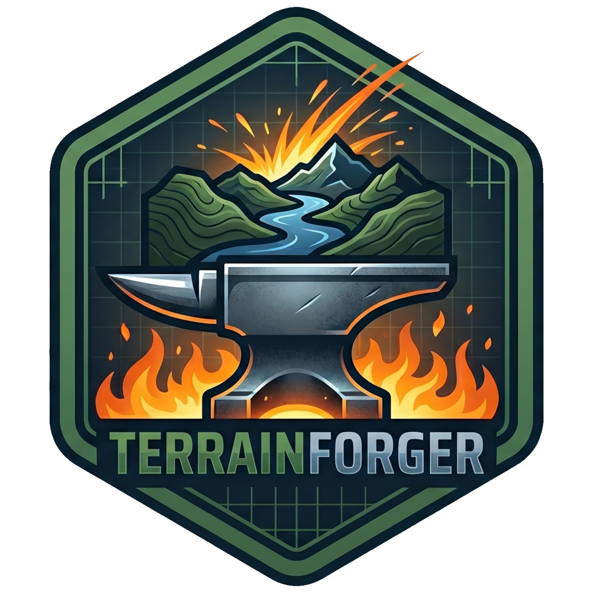

# TerrainForger

<p align="center">
  
</p>

TerrainForger is a Unity Editor package for GIS-driven terrain workflows. It helps you acquire DEM and satellite data, export tiled RAW and PNG terrain inputs, and import them back into Unity Terrain with a consistent pipeline.

## Package

- Package name: `com.arantes83.terrainforger`
- Package version: `0.1.1`
- Unity version declared in the package: `2020.3`
- Package type: editor-only
- GitHub repository: `https://github.com/Arantes83/terrainforger`
- Current release tag: `v0.1.1`

## Current Workflow

The current supported menu flow is:

```text
-> TerrainForger/Get GIS Data
-> TerrainForger/Geotiff2Raw Export
-> TerrainForger/Import Tiles
```

## Features

- Download DEM data through the integrated OpenTopography workflow
- Download satellite imagery through the integrated Mapbox or Google Maps Platform workflows
- Preview source rasters and DEM coverage inside the Unity Editor with previews docked in a right-hand column
- Export DEM GeoTIFFs to tiled RAW heightmaps
- Export satellite GeoTIFFs to tiled PNGs
- Mask coastlines during DEM export with either `GSHHG` or `OpenStreetMap`
- Import tiled RAW terrain data into Unity Terrain assets
- Configure the generated water plane altitude during tile import

## Reliability Safeguards

- External QGIS/GDAL operations are guarded with process timeouts and non-blocking stdout/stderr capture to prevent editor hangs.
- Satellite download plans are capped before execution to avoid runaway tile counts, integer overflow, excessive provider quota use, and memory spikes.
- Terrain import uses a compact single-layer alphamap when applying satellite textures, reducing memory pressure on large tile grids.
- Tool settings are saved only after actual UI changes instead of on every editor repaint.
- Auto-downloaded coastline datasets are extracted with path validation so archives cannot write outside the terrain data cache.

## Dependencies

Required Unity modules:

- `com.unity.modules.terrain`
- `com.unity.modules.imageconversion`

External requirements:

- Unity `2020.3` or newer within the package baseline
- QGIS installed locally for GDAL-based bounds, preview, cropping, reprojection, and export workflows
- Enough disk space for DEM, satellite, and generated terrain data

## Installation

### Recommended Release

For regular Unity projects, install the pinned release tag that matches the package version declared in `package.json`.

Add this entry to `Packages/manifest.json`:

```json
{
  "dependencies": {
    "com.arantes83.terrainforger": "https://github.com/Arantes83/terrainforger.git#v0.1.1"
  }
}
```

Or open `Window > Package Manager`, choose `Add package from git URL...`, and paste:

```text
https://github.com/Arantes83/terrainforger.git#v0.1.1
```

### Development Branch

Use `main` only when you intentionally want the latest repository state instead of a fixed release:

```text
https://github.com/Arantes83/terrainforger.git#main
```

### GitHub Release Page

The current release is available at:

```text
https://github.com/Arantes83/terrainforger/releases/tag/v0.1.1
```

The release asset `TerrainForger-v0.1.1-UPM-minimal.zip` contains the minimal Unity package files needed by the addon. The automatic GitHub `Source code` archives are generated by GitHub and may include repository files that are not part of the minimal package archive.

Minimal release archive contents:

```text
package.json
package.json.meta
Editor.meta
Editor/
LICENSE
LICENSE.meta
```

Recommended documentation files for public package archives:

```text
README.md
README.md.meta
CHANGELOG.md
CHANGELOG.md.meta
Documentation~/
```

### Local Development

Use `Add package from disk...` and point Unity to this repository's `package.json`.

## Generated Project Folders

TerrainForger writes generated content into the consuming Unity project. Typical folders are:

```text
Assets/
|-- Generated/
|   `-- TerrainTiles/
`-- Terrain/
    |-- GSHHG/
    |-- GeoTIFF/
    |-- OSMCoastline/
    |-- PNG/
    |-- Raw/
    |-- SAT/
    `-- Source/
```

Folder summary:

- `Assets/Terrain/GeoTIFF`: source or downloaded DEM rasters
- `Assets/Terrain/SAT`: downloaded satellite rasters
- `Assets/Terrain/Source`: stored local source files used for bounds and previews
- `Assets/Terrain/Raw`: exported RAW heightmap tiles
- `Assets/Terrain/PNG`: exported satellite PNG tiles
- `Assets/Terrain/GSHHG`: auto-downloaded GSHHG shoreline dataset
- `Assets/Terrain/OSMCoastline`: auto-downloaded OpenStreetMap land polygons
- `Assets/Generated/TerrainTiles`: generated Unity Terrain assets

## Data Services

The TerrainForger Data Services panel currently exposes:

- `OpenTopography`
- `Mapbox`
- `Google Maps Platform`
- `QGIS`

Important note:

- The integrated `Get GIS Data` workflow uses `OpenTopography` for DEM downloads and lets you choose `Mapbox` or `Google Maps Platform` for satellite downloads.
- Google Maps Platform satellite downloads use the official Map Tiles API session flow and remain subject to Google Maps Platform quota, attribution, and storage restrictions.

Direct credential pages:

- OpenTopography: `https://portal.opentopography.org/myopentopo`
- Mapbox: `https://console.mapbox.com/account/access-tokens/`
- Google Maps Platform: `https://console.cloud.google.com/apis/credentials`

## Credential Safety

- Credentials are stored locally in the consuming project's `UserSettings/TerrainDataServiceSettings.asset`.

## Documentation

- Package entry page: [Documentation~/index.md](Documentation~/index.md)
- Full manual: [Documentation~/UserManual.md](Documentation~/UserManual.md)
- Changelog: [CHANGELOG.md](CHANGELOG.md)

## License

This package is released under the MIT license. See [LICENSE](LICENSE).
